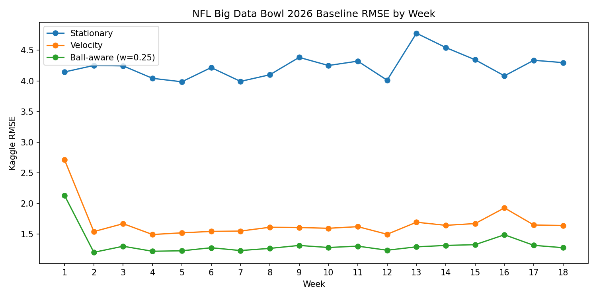
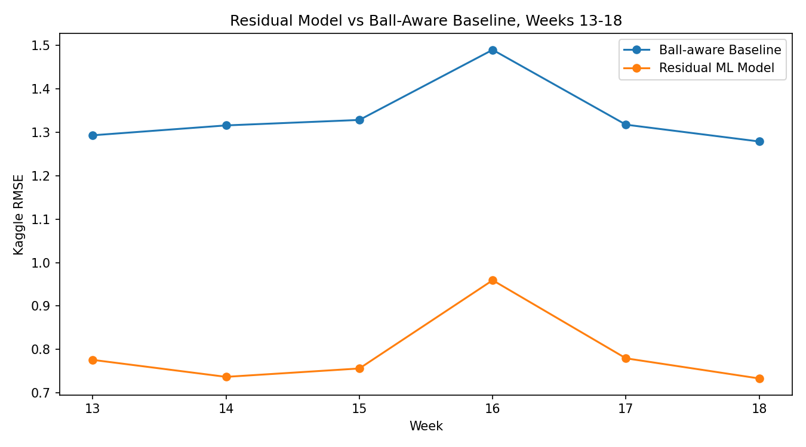
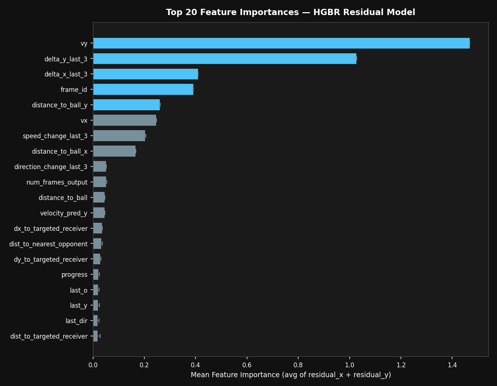
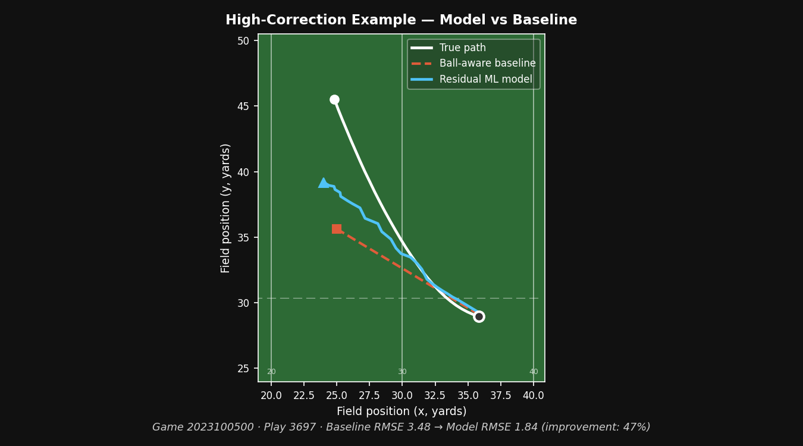
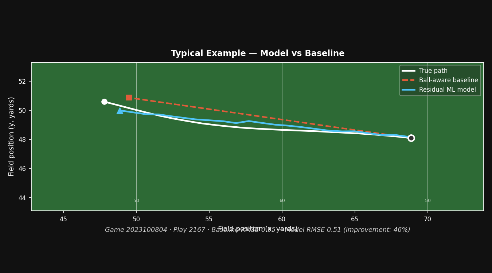

# NFL Big Data Bowl 2026

## Project Overview

Kaggle competition to predict NFL player trajectories after a pass is thrown. Given pre-throw tracking data for each play, the task is to forecast the `(x, y)` position of selected players for every future frame until the play ends.

## Data

- **Training data:** 18 weeks of 2023 NFL season tracking data (`train/input_2023_w01.csv` – `w18.csv`)
- **Input:** ~250–320k rows per week — one row per player per frame, including position, speed, acceleration, direction, orientation, and ball landing coordinates
- **Output:** ~28–37k rows per week — future `(x, y)` positions for `player_to_predict=True` players only
- **Test:** 2024 game data served play-by-play via the Kaggle evaluation API
- **Total rows evaluated (all 18 weeks):** 562,936

Player roles: `Targeted Receiver`, `Defensive Coverage`, `Other Route Runner`, `Passer`

## Baseline Models

Three non-ML baselines built on last-observed tracking state per `(game_id, play_id, nfl_id)`:

| Model | Description |
|---|---|
| **Stationary** | Predict last observed `(x, y)` for all future frames |
| **Velocity** | Dead-reckoning using last observed speed and direction: `vx = s·sin(dir)`, `vy = s·cos(dir)` |
| **Ball-aware (w=0.25)** | Blend of velocity prediction and linear interpolation toward `ball_land_x/y` based on frame progress |

Ball-aware formula:
```
progress  = frame_id / num_frames_output  (clipped 0–1)
ball_x    = last_x + progress * (ball_land_x - last_x)
x_pred    = 0.75 * velocity_x + 0.25 * ball_x
```

## Results

All 18 weeks, Kaggle-style RMSE (sqrt of mean squared errors pooled across x and y columns):

| Model | Kaggle RMSE |
|---|---|
| Stationary | 4.2437 |
| Velocity | 1.7056 |
| Ball-aware (w=0.25) | **1.3543** |



## Residual Machine Learning Model

A gradient boosting model is trained to predict the residual error of the ball-aware baseline, then added back to the baseline prediction.

- **Approach:** Predict `residual_x` and `residual_y` (true position minus baseline prediction), then add back to `baseline_x / baseline_y`
- **Model:** `HistGradientBoostingRegressor(max_iter=1000)` wrapped in `MultiOutputRegressor`, tuned via systematic holdout comparison
- **Validation:** Rolling week splits on weeks 1–5 (train on prior weeks, validate on next week)
- **Features:** Kinematic state at throw time (position, speed, acceleration, direction, orientation), ball landing coordinates, frame progress, player role/side/position, play direction and field position (`play_direction`, `absolute_yardline_number`), recent-motion features (delta position, speed/direction/acceleration change over last 1, 3, and 5 frames), route-level features from the full pre-throw input sequence (route start position, total distance traveled, route direction angle, mean speed), and player-interaction features: distance/dx/dy to the targeted receiver, nearest opponent, and nearest teammate (all from the final observed frame)

| Val Week | Train Rows | Baseline RMSE | Model RMSE | Improvement |
|---|---|---|---|---|
| 2 | 32,088 | 1.2037 | 1.1663 | 3.10% |
| 3 | 64,268 | 1.3025 | 1.1710 | 10.10% |
| 4 | 100,348 | 1.2209 | 1.0967 | 10.17% |
| 5 | 130,495 | 1.2283 | 1.0569 | 13.95% |
| **Average** | | **1.2388** | **1.1227** | **~9.4%** |

Best split: Week 5 — RMSE drops from 1.2283 to 1.0569 (13.95% improvement). Improvement scales with training data size, suggesting more weeks will continue to help.

Results saved to `outputs/residual_model_rolling_validation.csv`.

## Later-Season Holdout Validation

Full-season holdout evaluation using an expanded feature set.

- **Train split:** Weeks 1–12 (368,514 rows)
- **Validation split:** Weeks 13–18 (194,422 rows)
- **Features:** All kinematic features from the rolling model, plus geometry features: `velocity_pred_x` / `velocity_pred_y` (projected positions from velocity dead-reckoning), `vx` / `vy` (true velocity components), signed distance to ball (`distance_to_ball_x/y`), angle to ball, time remaining, binary role/side indicators (`is_targeted_receiver`, `is_defensive_coverage`, `is_offense`, `is_defense`), recent-motion features from the last observed tracking frames, and player-interaction features: distance/dx/dy to the targeted receiver, nearest opponent, and nearest teammate (all from the final observed frame)

| Metric | Value |
|---|---|
| Ball-aware baseline RMSE | 1.3438 |
| Residual ML model RMSE | **0.7986** |
| Improvement | **40.57%** |

Per-week results (weeks 13–18):

| Week | Baseline RMSE | Model RMSE | Improvement |
|---|---|---|---|
| 13 | 1.2931 | 0.7759 | 39.99% |
| 14 | 1.3158 | **0.7368** | **44.01%** |
| 15 | 1.3284 | 0.7561 | 43.08% |
| 16 | 1.4899 | 0.9593 | 35.61% |
| 17 | 1.3175 | 0.7795 | 40.83% |
| 18 | 1.2788 | 0.7331 | 42.67% |

The model improved RMSE on every validation week. Best single week: Week 14 at 44.01% improvement (model RMSE 0.7368). Results saved to `outputs/residual_model_w13_w18_validation.csv`.

**Per-role breakdown (weeks 13–18):**

| Player Role | Baseline RMSE | Model RMSE | Improvement |
|---|---|---|---|
| Targeted Receiver | 0.9929 | **0.5114** | **48.49%** |
| Defensive Coverage | 1.4587 | 0.8863 | 39.24% |

Targeted receivers are predicted more accurately than defensive players — their routes are more structured, making residuals easier to learn.



**Feature importance** (permutation importance, top features averaged across residual_x and residual_y):



y-axis velocity (`vy`) and recent y-displacement (`delta_y_last_3`) dominate — the lateral dimension carries most of the predictable signal. Recent motion features account for 4 of the top 7.

## Example Trajectory Corrections

Each plot below shows a single player's trajectory over the future frames of a play: the true recorded path (white), the ball-aware baseline prediction (red dashed), and the residual model's corrected prediction (blue). Both examples are drawn from week 5 held-out plays.

**High-correction example** — a harder trajectory where the baseline diverges noticeably from the true path. The model substantially reduces that error.



**Typical example** — a more representative mid-range trajectory. The baseline is already reasonable, and the model still improves on it.



## How to Run

1. Install dependencies:
```bash
pip install -r requirements.txt
```

2. Place the Kaggle competition data in the project root with this structure:
```
train/
test.csv
test_input.csv
kaggle_evaluation/
```

3. Build the ML dataset (all 18 weeks):
```bash
python build_ml_dataset.py
```

3. Run baseline validation across all 18 weeks:
```bash
python baseline_local_validation.py
```

4. Run baseline validation across all 18 weeks:
```bash
python baseline_local_validation.py
```

5. Train and validate the residual model (train weeks 1–12, validate weeks 13–18):
```bash
python train_residual_model.py
```

6. Generate plots:
```bash
python plot_baseline_results.py
python plot_model_validation.py
```

> **Note:** All scripts use `Path(__file__).resolve().parent` for paths and can be run from any directory.
>
> Large generated ML datasets (`outputs/ml_dataset_*.csv`) are excluded from git. Summary result CSVs and chart PNGs in `outputs/` are tracked.

## Key Takeaways

- The correct velocity decomposition is `vx = s·sin(dir)`, `vy = s·cos(dir)` — not the standard trig convention. Using `cos/sin` makes velocity worse than stationary.
- Week 16 is a consistent outlier with higher error across all models, likely due to game-type or scheduling differences in that week.
- `ball_land_x/y` is a strong signal. A 25% blend toward the ball landing point reduces RMSE by ~21% over pure velocity.
- Increasing `max_iter` from 300 to 1000 delivered the single largest RMSE drop in the ML phase (~0.033 absolute), with clear diminishing returns beyond 1000.
- Route-level features (start position, total distance, route direction) added meaningful signal beyond last-frame kinematics.
- Training separate models per player role (Targeted Receiver vs Defensive Coverage) produced no measurable improvement over a single model with role as a feature — HGBR learns the split internally.
- Permutation importance showed `vy` (y-velocity at throw) and `delta_y_last_3` as the dominant features, highlighting that lateral motion is the hardest and most predictable dimension.

## Next Steps

- Coordinate normalization by play direction — normalizing so all plays are in the same direction should improve consistency of positional features
- LightGBM comparison — generally faster and sometimes marginally better than HGBR on tabular data
- Kaggle test submission — wire up the `kaggle_evaluation` inference server for actual competition scoring
- Sequence modeling — LSTM or Transformer over the pre-throw trajectory could capture route patterns that tabular features miss
