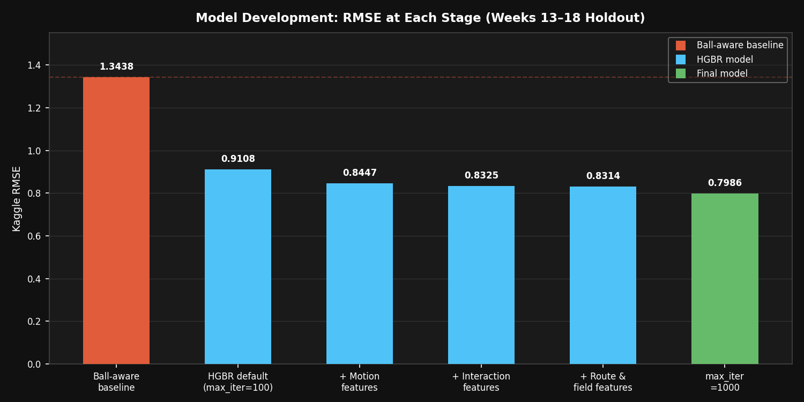
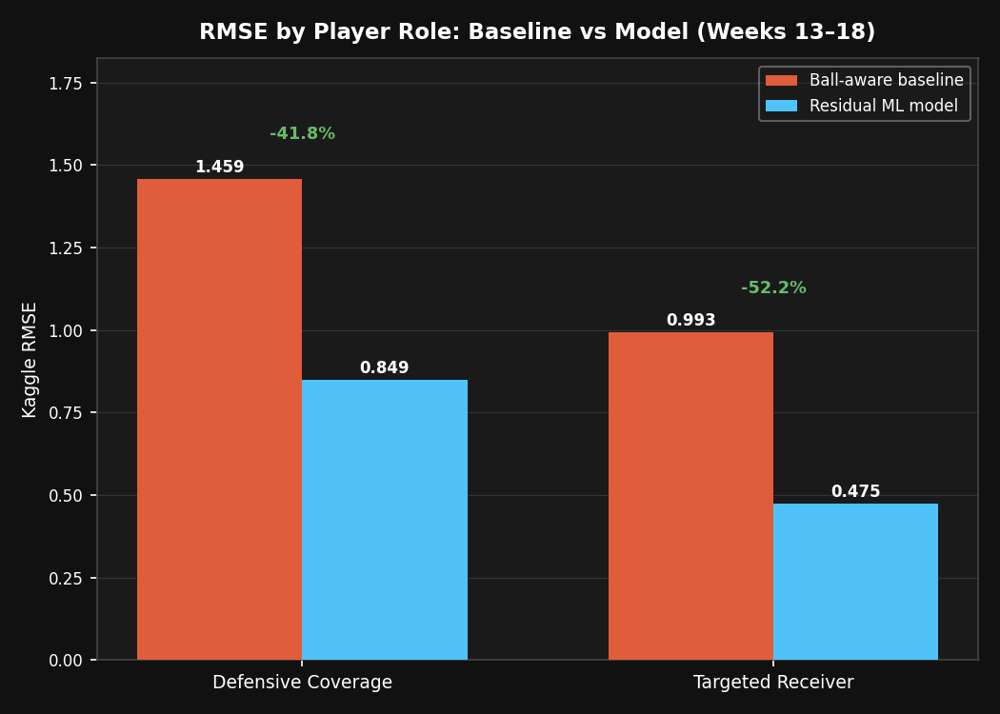
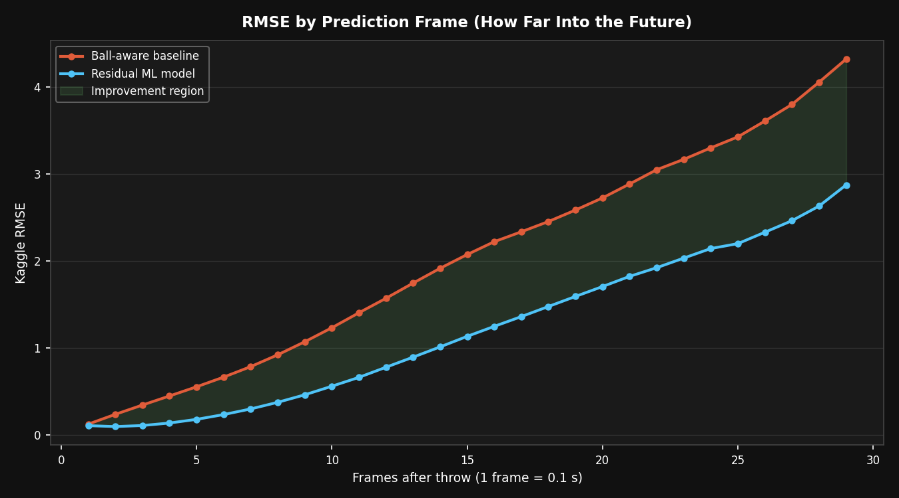
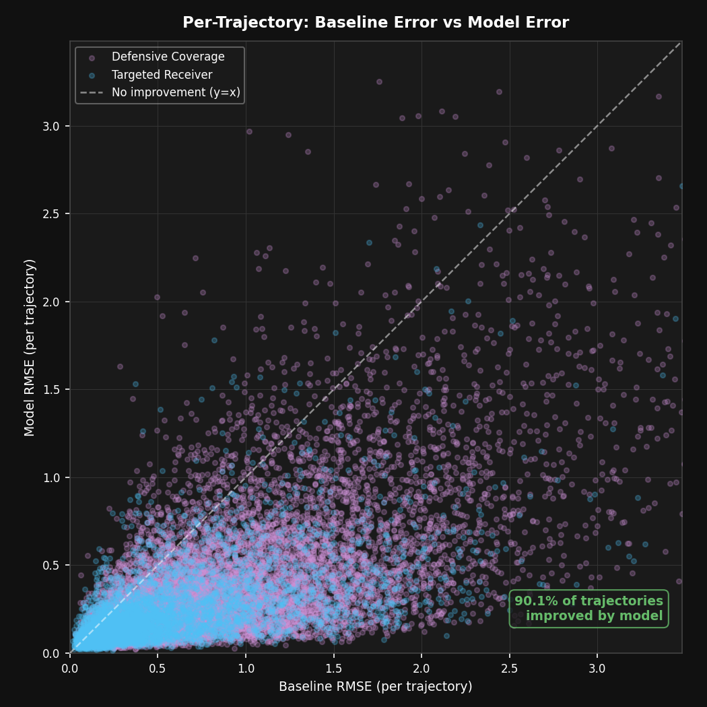

# NFL Big Data Bowl 2026 — Player Trajectory Forecasting


**Given tracking data from the moment a pass is thrown, predict where every key player will be for the rest of the play — frame by frame.**

This project builds a multi-stage prediction system: a hand-crafted physics baseline, a LightGBM residual model, and a GRU sequence model, combined into an ensemble. Trained and validated on 18 weeks of 2023 NFL season player-tracking data.

---

## Headline Result

> **48.5% improvement in prediction error over a strong physics-based baseline**
> — GRU sequence model, weeks 13–18 holdout (194,422 predictions)

| Model | RMSE | vs. Baseline |
|---|---|---|
| Ball-aware physics baseline | 1.3438 | — |
| LightGBM residual model | 0.7406 | −44.9% |
| **GRU sequence model** | **0.6921** | **−48.5%** |

---

## What Does It Actually Do?

Each prediction is a sequence of `(x, y)` positions, one per video frame, from throw-time until the play ends. Below are two examples from the held-out validation set.

**White** = where the player actually went · **Red dashed** = physics baseline · **Blue** = model prediction

**A hard case** — the player cuts sharply; the baseline overshoots, the model corrects most of the error:


**A typical case** — the baseline is already reasonable, but the model still improves on it:


---

## How It Works

### Step 1 — Physics Baseline

Before any ML, a hand-crafted baseline establishes how hard this problem is. Three approaches, each building on the last:

| Model | RMSE | What it does |
|---|---|---|
| Stationary | 4.2437 | Assumes the player stops moving at throw time |
| Velocity | 1.7056 | Dead-reckoning: projects forward using last observed speed and direction |
| Ball-aware | **1.3438** | Blends velocity with a pull toward where the ball lands (25% weight) |

The ball-landing coordinates are a strong signal — knowing roughly where the play is going reduces error by ~21% on their own.


### Step 2 — LightGBM Residual Model

Instead of predicting positions directly, the model learns the *error* the baseline makes — then corrects it. This residual approach lets the physics baseline handle the easy part (rough trajectory direction) while the ML handles the harder part (exactly how far and where).

**Key design choices:**
- **Coordinate normalization** — all plays are flipped to a canonical left-to-right orientation before features are extracted. Without this, the model would need to learn mirrored field dynamics simultaneously. This single change reduced RMSE by ~0.036 — the largest single gain in the project.
- **Route features** — extracted from the full pre-throw sequence: where the route started, how far the player traveled, what direction they were heading, their mean speed. These describe *what kind of route* was run before the throw.
- **Interaction features** — at throw time: distance and direction to the targeted receiver, nearest opponent, and nearest teammate.
- **Recent motion** — change in position, speed, and direction over the last 1, 3, and 5 frames before the throw.

**Development progression** — each bar is one incremental improvement, validated on the weeks 13–18 holdout:



**Holdout results (weeks 13–18, 194,422 predictions):**

| Week | Baseline RMSE | Model RMSE | Improvement |
|---|---|---|---|
| 13 | 1.2931 | 0.7454 | 42.4% |
| 14 | 1.3158 | **0.6864** | **47.8%** |
| 15 | 1.3284 | 0.7098 | 46.6% |
| 16 | 1.4899 | 0.8677 | 41.8% |
| 17 | 1.3175 | 0.7224 | 45.2% |
| 18 | 1.2788 | 0.6745 | 47.3% |
| **All weeks** | **1.3438** | **0.7406** | **44.9%** |

The model improves on every single week. Week 16 is a consistent outlier — higher error for both the baseline and the model, suggesting something structurally different about that week's games.


### Who's Easier to Predict?

Targeted receivers are significantly more predictable than defensive players — their routes are more structured and route-level features capture them better.

| Player Role | Baseline RMSE | Model RMSE | Improvement |
|---|---|---|---|
| Targeted Receiver | 0.9929 | **0.4541** | **54.3%** |
| Defensive Coverage | 1.4587 | 0.8264 | 43.3% |



### How Far Ahead Can It See?

Prediction error grows naturally as forecasts extend further into the future — the longer after the throw, the harder the prediction. But the model maintains a consistent improvement margin over the baseline at every horizon.



### Which Features Matter Most?

Permutation importance (how much RMSE increases when a feature is shuffled):


**y-velocity (`vy`) and recent y-displacement (`delta_y_last_3`) dominate** — the lateral dimension carries the most predictable signal. Four of the top seven features are recent-motion features, confirming that what a player was doing just before the throw is the strongest predictor of what they'll do after.

### How Does It Do Per Trajectory?

Each point below is one player trajectory in the validation set. Points below the diagonal mean the model beats the baseline on that trajectory; points above mean the baseline was better. The model wins the majority of trajectories, including most of the high-error cases.



---

### Step 3 — GRU Sequence Model

The LightGBM model works on per-frame rows — it can't see the full shape of a player's pre-throw route. A GRU sequence model encodes that trajectory directly.

**Architecture:**
- **Sequence encoder:** 2-layer GRU with hidden size 64 over the pre-throw trajectory (up to 50 frames). Each frame is represented by 8 features: relative position, speed, acceleration, and sin/cos of direction and orientation.
- **Prediction head:** Concatenates the GRU's final hidden state with 6 per-frame context features (`progress`, `t`, `vx`, `vy`, `distance_to_ball_x/y`), then passes through a 3-layer MLP → 2 outputs (`residual_x`, `residual_y`).
- **56,898 parameters** — intentionally small; the training set has ~30k trajectories and is CPU-only.

| Metric | Value |
|---|---|
| GRU val RMSE (weeks 13–18) | **0.6921** |
| LightGBM for comparison | 0.7406 |
| Improvement over LightGBM | −6.5% |

### Step 4 — Ensemble (future work)

`ensemble_blend.py` sweeps blend weights between GRU and LightGBM predictions (alpha 0.0 → 1.0) and reports RMSE at each mix. Given that the GRU already outperforms LightGBM by 6.5%, a blend may squeeze out additional improvement — ensembles tend to help when two models have complementary strengths (the GRU sees full trajectory sequences; LightGBM sees richer tabular features).

---

## Key Findings

- **The biggest single gain was a data preprocessing choice**, not a fancier model — flipping all plays to a canonical direction cut RMSE by ~0.036, more than any algorithmic improvement.
- **Ball landing coordinates are surprisingly powerful** — a 25% blend toward where the ball lands reduced baseline error by ~21%.
- **Lateral motion dominates** — `vy` (y-velocity at throw) is the most important feature by a wide margin. Predicting how far sideways a player moves is harder and more informative than forward motion.
- **More training data consistently helps** — rolling validation showed improvement scaling from 3% (2 weeks of training data) to 14% (5 weeks). Full-season training (12 weeks) reaches 45%.
- **Role-based models don't help** — training separate models for Targeted Receiver vs. Defensive Coverage produced no measurable improvement over a single model with role as a feature. LightGBM learns the split internally.
- **Week 16 is a structural outlier** — higher error across every model, every year. Likely a game-type or scheduling artifact (e.g. Christmas games, flex scheduling).
- **The correct velocity convention is `vx = s·sin(dir)`, `vy = s·cos(dir)`** — the reversed (standard trig) convention makes velocity *worse* than the stationary baseline.

---

## Data

18 weeks of 2023 NFL season player-tracking data from the [Kaggle Big Data Bowl 2026](https://www.kaggle.com/competitions/nfl-big-data-bowl-2026) competition.

- One row per player per frame, with position `(x, y)`, speed, acceleration, direction, orientation, and ball landing coordinates
- ~250–320k input rows per week; ~28–37k output rows (only `player_to_predict=True` players are scored)
- 562,936 total scored predictions across all 18 weeks
- Player roles: Targeted Receiver, Defensive Coverage, Other Route Runner, Passer

---

## How to Run

1. Install dependencies:
```bash
pip install -r requirements.txt
```

2. Place the Kaggle competition data in the project root:
```
train/
test.csv
test_input.csv
kaggle_evaluation/
```

3. Build the ML feature dataset (all 18 weeks):
```bash
python build_ml_dataset.py
```

4. Run baseline validation:
```bash
python baseline_local_validation.py
```

5. Train the LightGBM residual model (weeks 1–12 train, 13–18 validate):
```bash
python train_residual_model.py
```

6. Train the GRU sequence model:
```bash
python train_sequence_model.py
```

7. Run the ensemble blend sweep:
```bash
python ensemble_blend.py
```

8. Generate plots:
```bash
python plot_baseline_results.py
python plot_model_validation.py
python plot_feature_importance.py
python plot_sample_trajectories.py
```

> Large generated datasets (`outputs/ml_dataset_*.csv`) are gitignored. Result CSVs and chart PNGs in `outputs/` are tracked.
